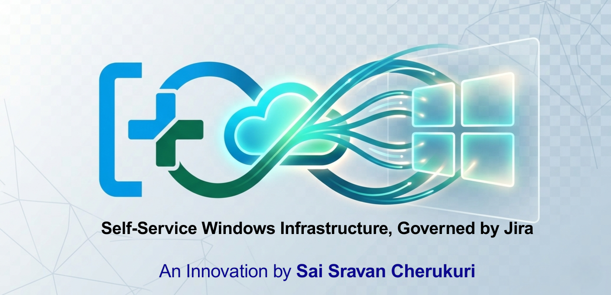

  

#  SkyBuild: AutoNode WinFlow
### **Self-Service Windows Infrastructure, Governed by Jira.**
*An Innovation by **Sai Sravan Cherukuri***

---

SkyBuild is an open-source framework that turns **Jira Service Management** into a powerful infrastructure orchestration engine. It bridges the gap between enterprise governance and automated Windows deployment.

* [ Getting Started Guide](./docs/GETTING_STARTED.md)
* [ Security Policy](./docs/SECURITY.md)[ Security](docs/SECURITY.md)

##  Overview
**SkyBuild** is an open-source framework designed to transform **Jira Service Management (JSM)** into a high-velocity provisioning engine. By treating Jira as the control plane, IT teams can automate the end-to-end lifecycle of Windows Server Virtual Machines while maintaining 100% visibility through **Jira Assets**.

### The Core Components:
* **SkyBuild (The Architecture):** A standardized JSM Portal for infrastructure requests.
* **AutoNode (The Engine):** Jira Assets-driven metadata management.
* **WinFlow (The Experience):** PowerShell-based orchestration that handles the "heavy lifting" of VM creation.

---

##  Data Architecture (Jira Assets)
The power of SkyBuild lies in its governance. Below is the required **Assets Object Schema** that serves as the Source of Truth for every deployment.

| Object Type | Attribute | Description |
| :--- | :--- | :--- |
| **VM Instance** | Hostname | Unique ID for the Windows Server. |
| **VM Instance** | IP Address | Reserved network identifier. |
| **VM Instance** | Specs | Assigned RAM and vCPU count. |
| **OS Library** | Image ID | Path to the approved Windows `.vhdx` or Gold Image. |
| **Environment** | Cluster | Target Hyper-V or VMware host group. |

---

##  Repository Structure
* **`/assets-schema/`**: Contains `.json` templates for importing the Object Schema into Jira.
* **`/automation-rules/`**: Pre-configured Jira Automation logic to trigger the WinFlow engine.
* **`/scripts/`**: The `Invoke-WinFlow.ps1` PowerShell module.
* **`/docs/`**: Technical documentation and architecture diagrams.

---

##  Strategic Roadmap
I am actively developing SkyBuild to move beyond simple provisioning into full **Platform Engineering**.

* [x] **Phase 1:** JSM Portal & Core WinFlow PowerShell engine.
* [ ] **Phase 2:** Atlassian Guard integration for automated identity & access governance.
* [ ] **Phase 3:** Multi-Cloud support for Azure ARM and AWS CloudFormation.
* [ ] **Phase 4:** Automated decommissioning and Asset cleanup workflows.

---

##  The Vision
I developed SkyBuild to address the 'Black Box' problem in infrastructure. By using Jira Assets as the source of truth, every automated build is inherently compliant, documented, and visible to the entire organization, not just the SysAdmin team.
> — **Sai Sravan Cherukuri**

---

##  Contributing
Contributions are what make the open-source community an amazing place to learn, inspire, and create. Any contributions you make are **greatly appreciated**.

1. Fork the Project
2. Create your Feature Branch (`git checkout -b feature/AmazingFeature`)
3. Commit your Changes (`git commit -m 'Add some AmazingFeature'`)
4. Push to the Branch (`git push origin feature/AmazingFeature`)
5. Open a Pull Request

##  License
Distributed under the **MIT License**. See `LICENSE` for more information.

---
##  Community & Passion
I developed this open-source project with a deep passion for sharing knowledge and adding tangible value to the IT industry. My goal is to empower the community by simplifying complex infrastructure challenges through automation. I believe that by helping each other grow, we elevate the entire industry.

### Let's Connect!
I am always open to discussing Atlassian ecosystems, DevSecOps, or infrastructure automation. Feel free to reach out or follow my journey:

👤 **Sai Sravan Cherukuri** 🔗 [Connect with me on LinkedIn](https://www.linkedin.com/in/sai-sravan-cherukuri-irs/)  
🌐 [Visit my Website](https://saisravancherukuri.com)

